# isopleth

Composable charts on **Apache ECharts 6**, with the grammar of [Observable Plot](https://observablehq.com/plot/) and **insights built in** — anomalies, forecasts, changepoints, seasonality, trends and outliers — computed by a **Rust core** (compiled to WebAssembly, built on [augurs](https://github.com/grafana/augurs)) with a pure-TypeScript fallback that works everywhere.

<p align="center">
  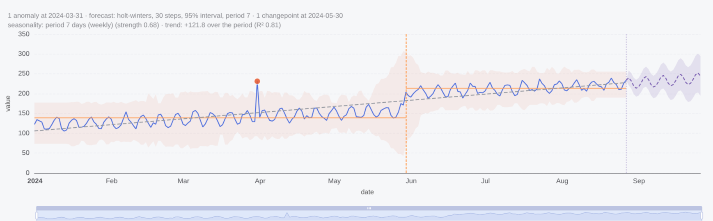
</p>

```ts
import * as ip from "isopleth";

ip.plot({
  marks: [ip.auto(data, { x: "date", y: "value" })],
  insights: { anomalies: true, forecast: { horizon: 30 }, changepoints: true, seasonality: true, trend: true },
  x: { zoom: true },
}).render(document.querySelector("#chart"));
```

One `auto` mark, one `insights` object: the chart above is the result. The red dot is a point anomaly against the shaded expected band; the orange rule and step lines mark a changepoint and the segment means; the dashed purple line and band are a 30-step forecast with its 95% interval; the grey dashes are the trend. Every finding is also returned as data with a one-line summary (the subtitle).

A chart is a list of **marks** (`lineY`, `areaY`, `barY`, `rectY`, `dot`, `cell`, `ruleX`, `text`, `differenceY`, …). Each mark is `mark(data, options)` where options are **channels** (`x`, `y`, `fill`, `stroke`, `r`, `fx`, …) bound to fields, accessors or arrays. **Transforms** (`binX`, `groupX`, `stackY`, `windowY`, `mapY`, `normalizeY`, `intervalX`, `imputeY`, `shiftX`, …) are functions over options that nest: inner first. `plot()` compiles everything into a single ECharts `option` you can render, serialize, or merge into your own ECharts setup.


## Gallery

All of these are in the demo (`npm run dev`); each is a handful of lines.

<table>
  <tr>
    <td width="50%">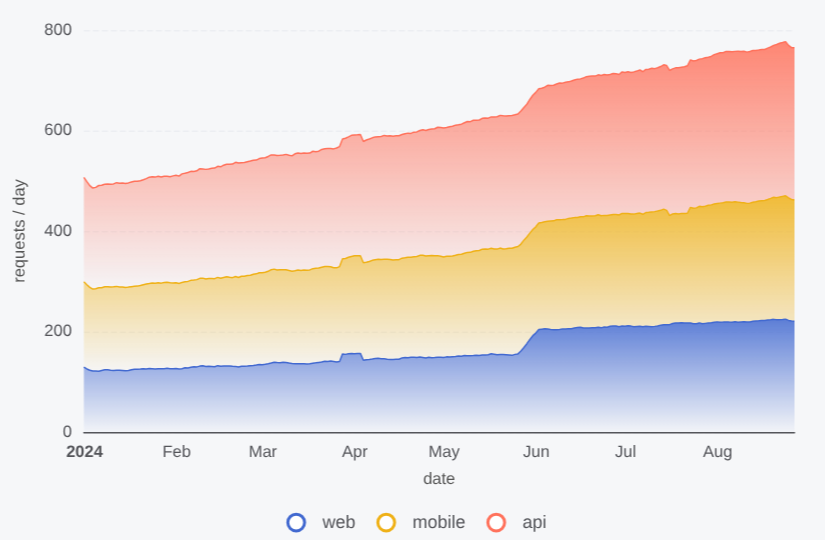<br><sub><b>stacked areas · rolling mean · gradients</b> — <code>areaY(data, windowY(7, { x, y, fill: "series", gradient: true }))</code></sub></td>
    <td width="50%">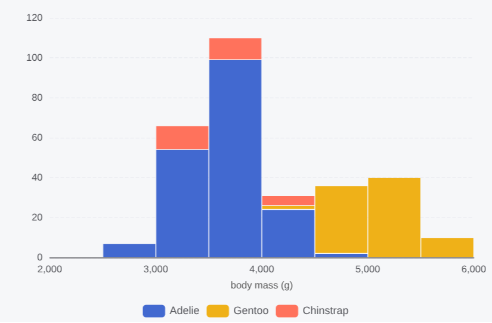<br><sub><b>histogram</b> — <code>rectY(data, binX({ y: "count" }, { x: "mass", fill: "species" }))</code></sub></td>
  </tr>
  <tr>
    <td>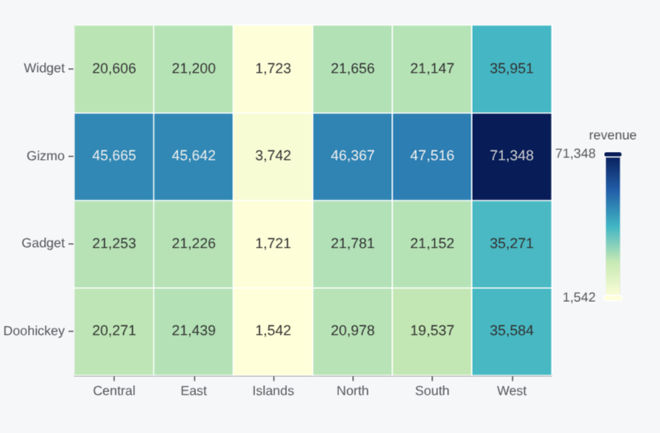<br><sub><b>heatmap</b> — <code>cell(data, group({ fill: "sum" }, { x: "region", y: "product", fill: "revenue" }))</code></sub></td>
    <td>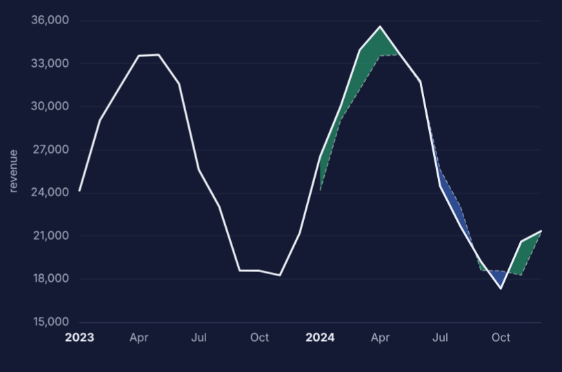<br><sub><b>difference, year over year</b> — <code>differenceY(data, shiftX("+1 year", groupX({ y: "sum" }, { x: "month", y: "revenue" })))</code></sub></td>
  </tr>
  <tr>
    <td>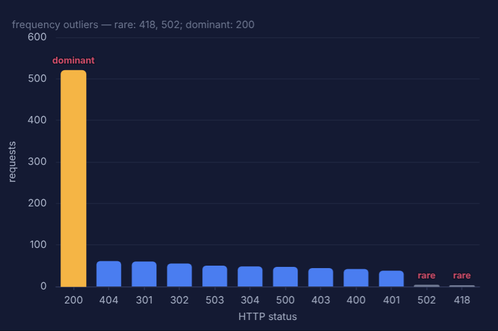<br><sub><b>frequency outliers</b> — <code>barY(data, groupX({ y: "count" }, { x: "status" }))</code> + <code>insights: { frequencyOutliers: true }</code></sub></td>
    <td>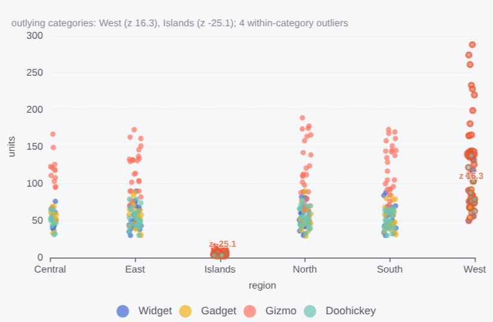<br><sub><b>category outliers</b> — <code>dot(data, { x: "region", y: "units", fill: "product" })</code> + <code>insights: { categoryOutliers: true }</code>, <code>x: { jitter: 14 }</code></sub></td>
  </tr>
  <tr>
    <td>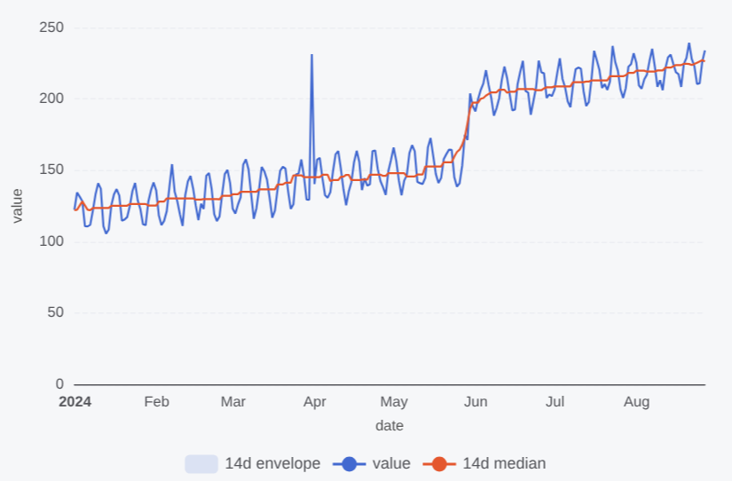<br><sub><b>rolling min / max envelope</b> — <code>areaY(data, map({ y1: window({ k: 14, reduce: "min" }), y2: window({ k: 14, reduce: "max" }) }, …))</code></sub></td>
    <td>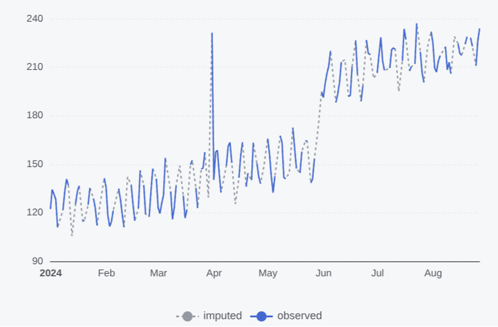<br><sub><b>missing data</b> — <code>lineY(sparse, { x, y, interval: "day" })</code> shows gaps; <code>imputeY("linear", …)</code> fills them</sub></td>
  </tr>
  <tr>
    <td>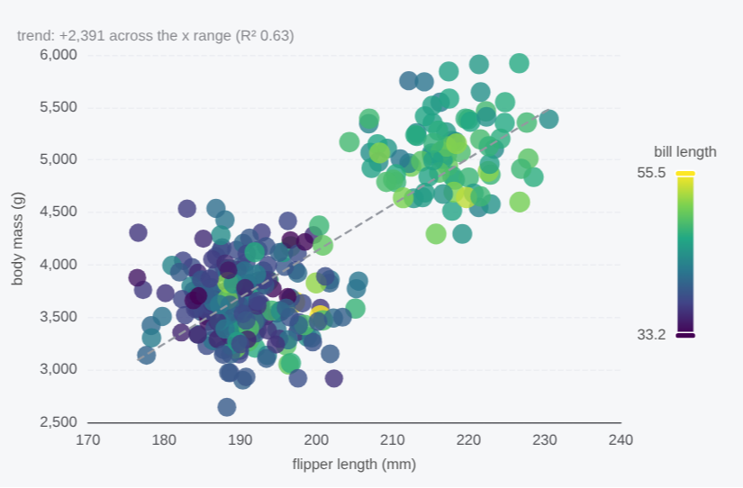<br><sub><b>scatter</b> — <code>dot(data, { x, y, r: "bill", fill: "bill" })</code> + <code>insights: { trend: true }</code></sub></td>
    <td>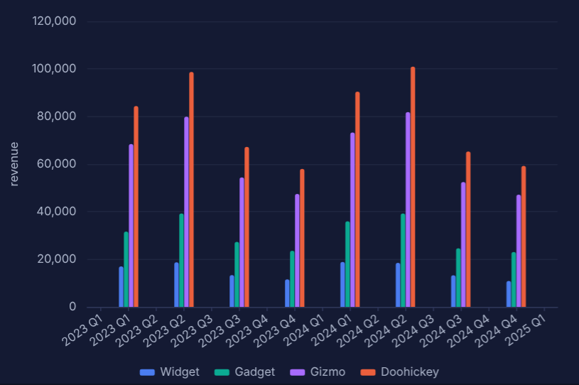<br><sub><b>time binning, dodged bars</b> — <code>barY(data, binX({ y: "sum", interval: "quarter" }, { x: "month", y: "revenue", fill: "product", dodge: true }))</code></sub></td>
  </tr>
  <tr>
    <td colspan="2">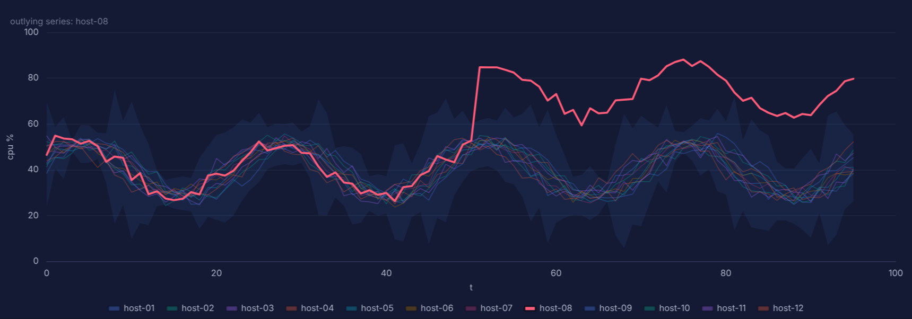<br><sub><b>series outliers</b> — twelve hosts, <code>insights: { seriesOutliers: true }</code> finds the one that drifts, dims the rest and shades the normal band</sub></td>
  </tr>
  <tr>
    <td colspan="2">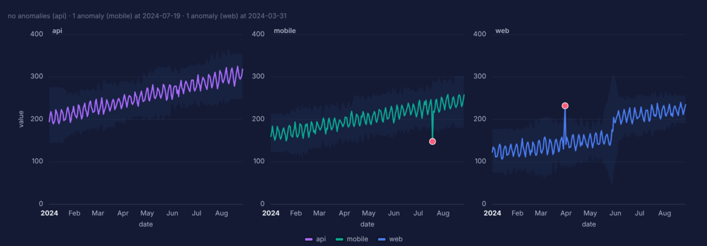<br><sub><b>facets</b> — <code>lineY(data, { x, y, stroke: "series", fx: "series" })</code>; the anomaly insight runs per facet</sub></td>
  </tr>
  <tr>
    <td colspan="2">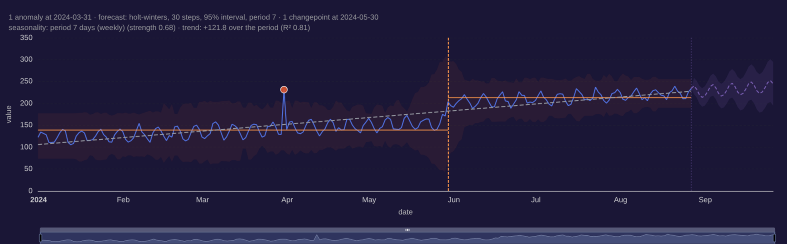<br><sub><b>dark theme</b> — <code>theme: "dark"</code> (any ECharts theme name or object)</sub></td>
  </tr>
</table>

## Install

```sh
npm install isopleth echarts            # peer dependency: echarts >= 6
npm install @isopleth/wasm              # optional: the Rust/WASM backend
```

```ts
import * as ip from "isopleth";
import { loadWasm } from "isopleth/wasm";

await ip.init(loadWasm());   // optional; falls back to the JS backend if it fails
```

## Why

- **Composable, not configurable.** ECharts options are powerful but imperative; every chart becomes a bespoke object. isopleth gives you Plot's small algebra — data + channels + transforms + marks — and compiles it to ECharts, so you keep ECharts' rendering, interaction, themes and ecosystem.
- **Insights are marks.** `insights: { anomalies: true }` runs a detector per series and *adds marks* (dots, bands, rules, labels) that go through the same compiler. They work on hand-built charts and on `auto` charts, and every insight is also returned as data with a one-line summary.
- **Fast where it matters.** Binning, grouping, rolling windows and all the time-series models live in `isopleth-core` (Rust). The same kernels are ported to TypeScript, so the library works without WebAssembly and you can turn it on for large data or the augurs models.

## Marks

| Mark | Channels | Notes |
| --- | --- | --- |
| `lineY(data, {x, y})` / `lineX` / `line` | `x y z stroke` | `curve: "monotone-x" \| "step" \| …`, `connectNulls`, `interval: "day"` reveals gaps |
| `areaY` / `areaX` / `area` | `x y1 y2 fill` | implicit `stackY` when only `y` is given; `gradient: true` fades the fill |
| `barY` / `barX` | ordinal `x`, `y1 y2 fill` | implicit stacking; `dodge: true` for side-by-side bars |
| `rectY` / `rectX` / `rect` | `x1 x2 y1 y2 fill` | quantitative edges (histograms via `binX`); custom-series rectangles |
| `cell` | ordinal `x y`, `fill` | heatmaps; continuous `fill` gets a visualMap |
| `dot` | `x y r fill stroke` | `r` is a sqrt size scale; `x: {jitter: 10}` for beeswarms (ECharts 6) |
| `ruleX([v])` / `ruleY([v])` | `x` or `y`, optional `y1 y2` / `x1 x2` | full-span rules (markLine) or segments |
| `text(data, {x, y, text})` | `x y text fill` | labels |
| `differenceY(data, {x, y1, y2})` | `x1 x2 y1 y2` | positive/negative fills; pair with `shiftX("+1 year", …)` |
| `auto(data, {x, y, color, size, mark?})` | | picks mark + transform from channel types (Plot's heuristics); `autoSpec()` explains the choice |
| `frame()`, `gridX()`, `gridY()` | | |

Common options: `fill`, `stroke` (CSS color = constant, anything else = channel), `fillOpacity`, `strokeWidth`, `strokeDasharray`, `curve`, `symbol`, `tip`, `title`, `channels: {Label: "field"}` (extra tooltip rows), `sort: {x: "-y"}` (ordinal domain order), `filter`, `reverse`, `id`, `name`, `legend`, `z2`, `echarts: {…}` (per-series escape hatch).

## Transforms

```ts
ip.rectY(data, ip.binX({ y: "count" }, { x: "weight", fill: "sex" }))                  // histogram
ip.barY(data, ip.groupX({ y: "sum" }, { x: "region", y: "sales", sort: { x: "-y" } }))  // grouped bars
ip.cell(data, ip.group({ fill: "mean" }, { x: "day", y: "hour", fill: "temp" }))        // heatmap
ip.areaY(data, ip.stackY({ offset: "normalize", order: "sum" }, { x, y, fill }))        // 100% stack
ip.lineY(data, ip.windowY({ k: 28, reduce: "median", anchor: "end" }, { x, y }))        // rolling median
ip.areaY(data, ip.map({ y1: ip.window({ k: 14, reduce: "min" }), y2: ip.window({ k: 14, reduce: "max" }) }, { x, y1: "v", y2: "v" }))
ip.lineY(data, ip.normalizeY("first", { x, y, stroke: "ticker" }))                      // index chart
ip.lineY(data, ip.mapY("cumsum", { x, y }))
ip.lineY(data, ip.intervalX({ interval: "hour", reduce: "sum", fill: 0 }, { x, y }))     // time binning + gap filling
ip.lineY(data, ip.imputeY("linear", { x, y }))                                            // fill missing values
ip.differenceY(data, ip.shiftX("+1 year", { x: "date", y: "value" }))                    // year-over-year
ip.text(data, ip.selectLast({ x, y, text: "name" }))                                      // end-of-line labels
```

- **bin** / **group**: `binX`, `binY`, `bin`, `groupX`, `groupY`, `group`, `groupZ`. Outputs are `{channel: reducer}`; reducers are `count sum mean median min max mode first last deviation variance distinct proportion proportion-facet min-index max-index pNN` or a function. Bin options: `thresholds` (`"auto"` Scott-capped-200, `"sturges"`, `"scott"`, `"freedman-diaconis"`, a count, an array, an interval), `interval`, `domain`, `cumulative`, `filter: null` (keep empty bins). Time channels bin on calendar intervals.
- **stack**: `stackY`/`stackX` (+ `stackY1/Y2`), `offset: "normalize" | "center" | "wiggle"`, `order: "value" | "sum" | "appearance" | "inside-out" | field | array`, `reverse`. Diverging stacks (negatives below zero) by default.
- **window / map**: `windowY(k | {k, anchor, reduce, strict})`, `mapY("cumsum" | "rank" | "quantile" | "diff" | "pct-change" | fn)`, `map({y1: …, y2: …})`, `normalizeY(basis)`, `imputeY("linear" | "previous" | "next" | "zero" | n)`, `diffY`, `cumsumY`, `shiftX(interval)`.
- **interval**: `intervalX({interval, reduce, fill, domain})` snaps to steps and inserts the missing ones (gaps or filled). Any mark accepts `interval` directly.
- **select / basic**: `selectFirst/Last/MinY/MaxY/MinX/MaxX`, `filter`, `sort`, `reverse`, `shuffle`.

Transforms compose by nesting; the inner one runs first: `windowY(7, binX({y: "count"}, {x: "date"}))`.

## Insights

```ts
ip.plot({
  marks: [ip.lineY(data, { x: "date", y: "value", stroke: "host", id: "cpu" })],
  insights: {
    anomalies: { method: "seasonal", sensitivity: 0.6 },      // mad | zscore | iqr | seasonal | ewma
    forecast: { method: "auto", horizon: 24, level: 0.9 },   // ets | mstl (wasm) · holt | holt-winters | drift | naive
    changepoints: { model: "linear" },                        // binseg (linear | mean) · argpcp | normal-gamma (wasm, opt-in)
    seasonality: true,                                        // periodogram (wasm) + autocorrelation
    trend: { method: "theil-sen" },                           // ols | theil-sen
    seriesOutliers: { target: "cpu" },                        // dbscan (wasm) | mad
    frequencyOutliers: true,                                  // rare / dominant categories in bar charts
    categoryOutliers: { within: true },                       // categories whose values stand out, points odd within their category
  },
});
```

| Insight | Applies to | Draws |
| --- | --- | --- |
| `anomalies` | marks with continuous `x` and `y`, per series | expected band + red dots; flagged points are highlighted on the mark |
| `forecast` | same | dashed forecast line, confidence band, start rule; `fitted: true` adds the in-sample fit |
| `changepoints` | same | dashed vertical rules + segment mean lines |
| `seasonality` | same | summary only (`"period 7 days (weekly), strength 0.68"`) |
| `trend` | same | dashed trend line |
| `seriesOutliers` | ≥ 3 series on one mark | outlying series highlighted, others dimmed, normal band shaded |
| `frequencyOutliers` | bar charts (ordinal axis) | rare/dominant bars recoloured and labelled |
| `categoryOutliers` | ordinal `x` + numeric `y` | outlying categories labelled with their z-score; within-category outliers highlighted |

Every insight accepts `target: "markId"`, `show: false` (compute without drawing) and `color`. Mark-level `insights` override plot-level ones. `chart.insights` holds `{kind, mark, series, summary, method, backend, data}`; `annotate: false` keeps the summaries out of the subtitle.

## Scales, facets, themes

```ts
ip.plot({
  marks: [ip.lineY(data, { x: "date", y: "value", fx: "region" })],
  x: { zoom: true, label: "Date", ticks: "month" },
  y: { grid: true, zero: true, percent: false, type: "log", breaks: [{ start: 100, end: 900 }] },
  color: { scheme: "tableau10", legend: true },               // or range: [...], type: "diverging", domain
  facet: { sharedY: false, gap: 6 },
  theme: "dark",                                              // ECharts theme name or object
  title: "Latency", subtitle: "p95 per region", caption: "Source: …",
  tooltip: "axis", legend: true, animation: false,
  echarts: { toolbox: { feature: { saveAsImage: {} } } },     // merged last
});
```

Scale types are inferred from the data (strings/booleans → category axis, dates → time axis, numbers → value axis). `chart.option` is a plain ECharts option: `chart.render(el)` uses a tree-shaken `echarts/core` with only the needed modules; `chart.toSVG()` renders server-side with ECharts' SSR mode (used by the test suite — no DOM required).

## Backends

| | `js` (default) | `wasm` (`@isopleth/wasm`) |
| --- | --- | --- |
| binning, grouping, windows, maps, imputation | ✓ | ✓ |
| anomalies (mad, zscore, iqr, seasonal, ewma) | ✓ | ✓ |
| forecast | naive, drift, Holt, Holt–Winters | + augurs **AutoETS**, **MSTL** |
| changepoints | binary segmentation (linear/mean) | + augurs **ARGPCP**, **Normal–Gamma** BOCPD (opt-in; O(n²)) |
| seasonality | autocorrelation | + augurs **periodogram** |
| series outliers | per-timestamp MAD | + augurs **DBSCAN** |
| frequency / category outliers, trend | ✓ | ✓ |

When the JS backend substitutes a model, the insight's `warnings` says so. Build the WASM package with:

```sh
rustup target add wasm32-unknown-unknown
cargo install wasm-pack
npm run build:wasm           # → packages/wasm/pkg
```

## Repository

```
crates/isopleth-core    Rust kernels (bin, group, window, map, impute, insights/*)   cargo test
crates/isopleth-wasm    wasm-bindgen bindings → @isopleth/wasm                         npm run build:wasm
packages/isopleth       the TypeScript library                                        npm test · npm run build
packages/wasm           npm package wrapping the wasm-pack output
packages/demo           Vite gallery (14 examples, light/dark, wasm toggle)           npm run dev
```

```sh
npm install
cargo test --workspace && npm test -w isopleth     # 41 Rust + 47 TS tests
npm run dev                                        # http://localhost:5173
```

### How it works

1. **Marks** are plain `{type, data, options}` objects; constructors apply Plot's implicit transforms (`areaY`/`barY`/`rectY` stack, `interval` snaps).
2. **Resolve**: facets (`fx`/`fy`) become index arrays; each mark's composed `transform(data, facets)` runs (bin/group produce new rows, window/stack/map fill lazy columns); channels are evaluated.
3. **Insights** run on the resolved series and append generated marks + per-item highlights.
4. **Scales** are inferred across all marks (x, y, color, r) including the generated ones, so forecasts extend the axis.
5. **Compile**: each mark × facet × series becomes ECharts series (`line`, `bar`, `scatter`, `heatmap`, `custom` for rects/bands/segments), with native stacking for zero-based stacks and exact polygons for arbitrary bands; axes, grids, legend, tooltip, visualMap and dataZoom are assembled around them.

### Status

Early. The grammar, compiler and insight layer are complete and tested; the API will move as it gets used. Not yet: dodge/hexbin transforms, geo/polar coordinates, label layout tuning, bundle-size work on the ECharts imports.

### Credits

[Observable Plot](https://github.com/observablehq/plot) for the grammar (bins and ticks are a faithful port of d3-array), [augurs](https://github.com/grafana/augurs) for the forecasting/outlier/changepoint/seasonality models, [Apache ECharts](https://echarts.apache.org/) for rendering. A successor to [isocline](https://github.com/DanielMcSheehy/isocline).

MIT.
